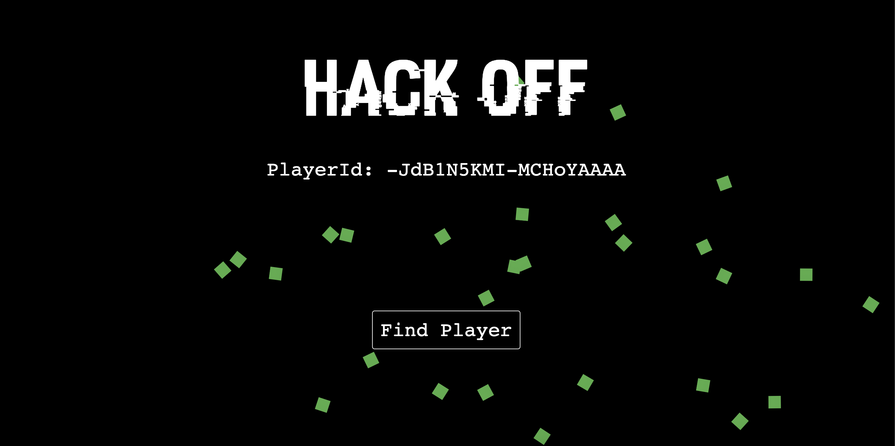
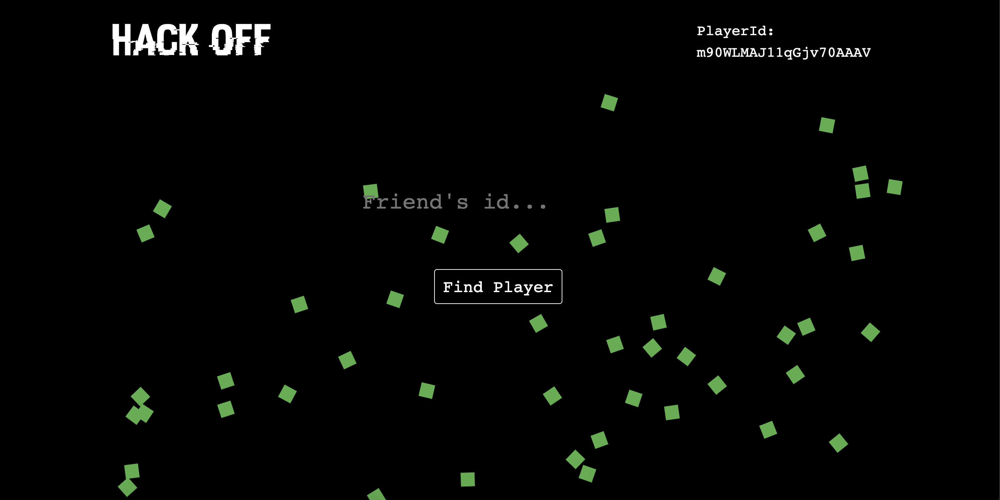
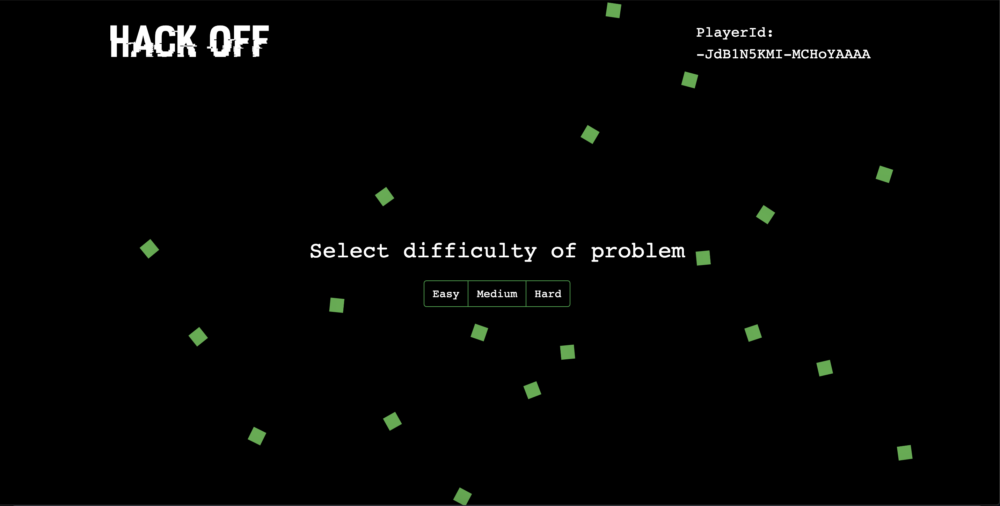
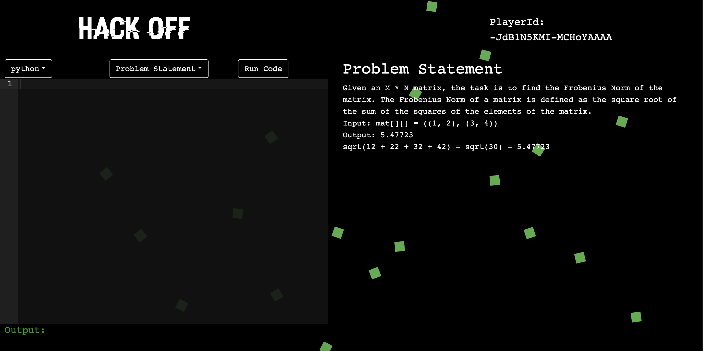
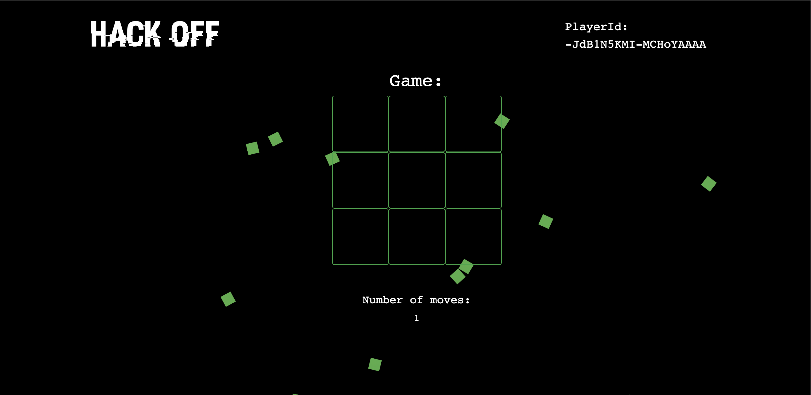

# HackOff

Ever wanted to prove to your friend, you're better than him at coding! Challenge him to a game of HackOff. In this lightning paced coding environment, you can best your opponent in a battle to the end.

## Inspiration

Inspired by intense duels between hacker and hacker, hacker and government, HackOff aims to bring that experience to you. The blood pressure raising, tension inducing contest will bring out your truest skills.

## What it does

Hack Off is an interactive game which involves two players who competing against each other to solve coding challenges to make their move in the game integrated along with the challenge.

### Finding the player

We use sockets and a queue to implement our backend to match players up with their friends.

### Picking a difficulty

Pick a difficulty: easy, medium or hard. You get more moves the harder your difficulty.

### Playing the game

First solve the coding question succesfully

Then move on to play your move

Solve problems quicker, and use your advantage to outwit your opponent in an intense game of the mind.

Win before your opponent, in a battle for pride.

## How we built it

### Client

#### ReactJs

Our client is built using react and react-bootstrap, custom css styling has been used.

#### ReactSky

A premade react library for creating the background.

#### ReactAce

A premade react library for making the text editor.

### Server

#### Sockets

Our server uses sockets to connect and exchange data, we have a queue of games for multiple players and people to join.

#### Code Compiling API

We use a REST API to compile code and execute it on a remote server, to solve our problems.

## Challenges we ran into

- Redux: setting up of react redux was a difficult procedure
- Making custom chess version: We couldn't open source any chess engine as we were making our own version of chess where you could move twice
- Finding Problems: Finding data on coding problems was very difficult, we had to manually make questions for our game in the required format.

## Accomplishments that we are proud of

- Front End- the front end of the application has resulted in a beautiful interface
- Socket - the socket application is connected well, the server

## What I learned

- Front End - making clean react apps
- Socket- making of backends with socket connections

## What's next for Hack Off

- Deploying our server onto a cloud engine
- Making more quality of life improvements, like friends, game sessions, and more games!
